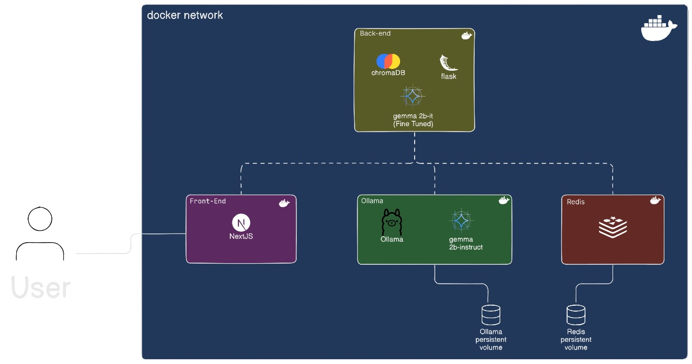
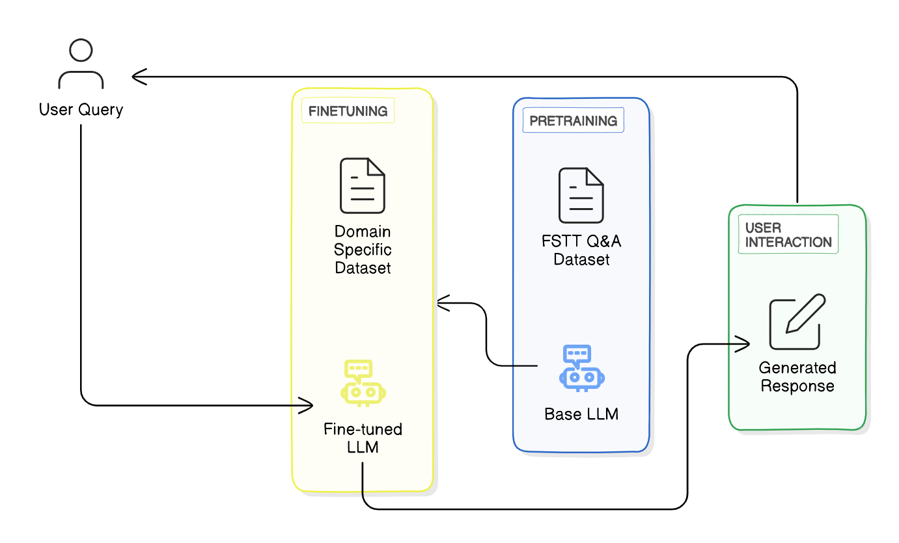
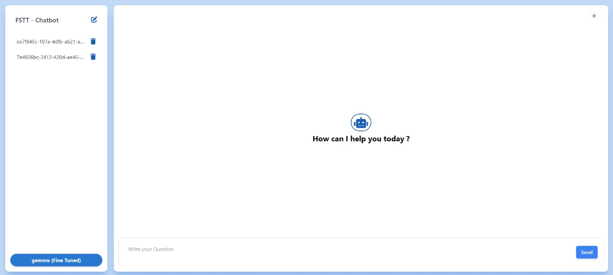
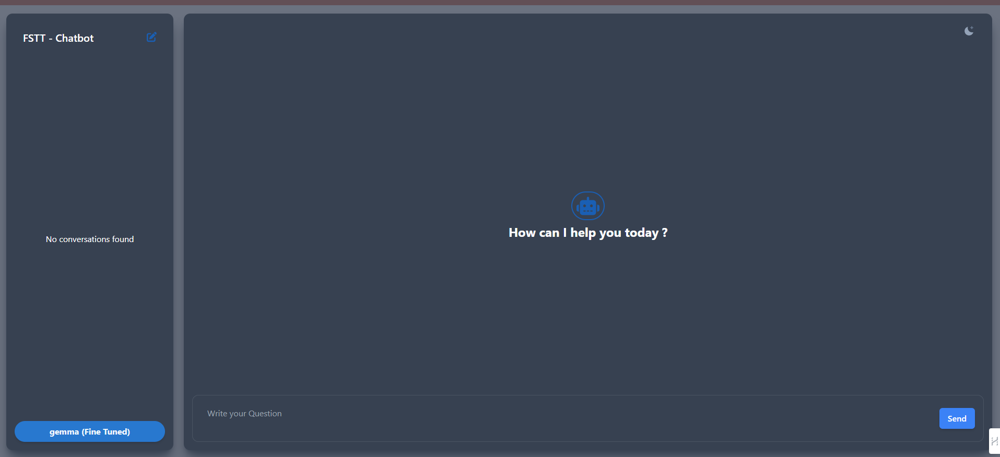
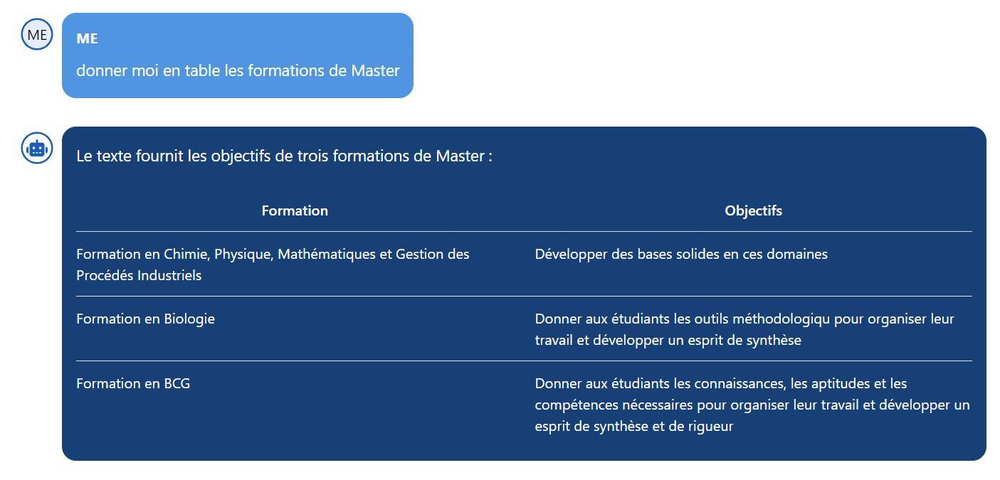

# FSTT ChatBot with RAG and Fine-Tuning

This repository contains a chatbot application with two model options: Retrieval-Augmented Generation (RAG) and a fine-tuned model. The application is built using Next.js, Ollama, Flask, and Docker.

## Table of Contents

- [Introduction](#introduction)
- [Technologies Used](#technologies-used)
- [Architecture](#architecture)
  - [System Components Overview](#System-Components-Overview)
- [Methodology](#Methodology)
  - [Data Collection](#Data-Collection)
  - [RAG (Retrieval-Augmented Generation)](#rag-retrieval-augmented-generation)
  - [Fine-Tuned Model](#fine-tuned-model)
  - [Front-End](#front-end)
- [Comparative Summary](#Comparative-Summary)
- [Conclusion](#Conclusion)
- [Installation](#installation)
- [Usage](#usage)
- [Contributeurs](#Contributeurs)
- [License](#license)

## Introduction

This project demonstrates the implementation of a chatbot with two model options: Retrieval-Augmented Generation (RAG) and a fine-tuned model. The frontend is developed with Next.js, and the backend services are handled using Flask. Docker is used to containerize the application for easy deployment and scalability.
### Demanded architecture

## Technologies Used

- **Next.js**: A React framework for building server-side rendered and statically generated web applications.
- **Ollama**: A library for natural language processing.
- **Flask**: A lightweight WSGI web application framework in Python.
- **Docker**: A platform for developing, shipping, and running applications in containers.
- **CHromaDB** : A vector database for context retreving.

## Architecture
The architecture implemented of our chatbot is composed of various components:


### System Components Overview

| **Component**        | **Technology**                                | **Function**                                                                                          |
|----------------------|-----------------------------------------------|-------------------------------------------------------------------------------------------------------|
| **Front-End**        | Next.js                                       | Provides the user interface for the application. Receives user requests and communicates with the back-end to fetch data. |
| **Back-End**         | Flask, ChromaDB, Gemma-2b-it (Fine Tuned)     | Handles the business logic, processes data, and interacts with the database. Serves data to the front-end.                  |
| **Ollama**           | Ollama, Gemma 2b-instruct                     | Provides specific instruction-based processing or functionalities, possibly related to AI or machine learning tasks.         |
| **Redis**            | Redis                                         | Used for caching and fast data retrieval to support the back-end operations.                                                  |
| **Persistent Volumes** | Docker Volumes                               | Store data for Ollama and Redis that remains even if the containers are restarted.                                             |
| **Docker Network**   | Docker Network                                | Allows all components to communicate with each other within the containerized environment.                                    |
## Methodology
### Data Collection
We started by scraping relevant data from the FSTT website using Beautiful Soup. The data included detailed information on courses, faculty clubs, and general institutional details. The scraped data was stored in ChromaDB, a vector database for efficient embedding-based similarity searches.


### RAG (Retrieval-Augmented Generation)

Retrieval-Augmented Generation (RAG) is a hybrid model architecture that combines the strengths of retrieval-based and generative models. It retrieves relevant documents or passages from a knowledge base and then generates a response based on the retrieved information. This approach enhances the chatbot's ability to provide accurate and contextually relevant answers.

#### RAG Architecture

1. **Retrieval Module**: This module searches a knowledge base to find the most relevant documents or passages related to the user's query. In our implementation, we use **ChromaDB** for efficient retrieval and management of large text datasets.
2. **Generator Module**: After retrieving the relevant information, the generator module, powered by **Ollama**, uses it to produce a coherent and contextually appropriate response.

#### How RAG Works

1. **User Query**: The process begins when a user submits a query to the chatbot.
2. **Document Retrieval**: The retrieval module queries ChromaDB to find the most relevant documents or passages that match the user's query.
3. **Information Processing**: The retrieved information is then passed to the generator module.
4. **Response Generation**: The generator module (Ollama) processes the information and generates a response based on the retrieved documents.
5. **Response Delivery**: The generated response is sent back to the user.

The RAG technique combines retrieval mechanisms with generative models to improve response accuracy. The key components include:
- **Flask Web Application**: Manages HTTP requests and responses.
- **Chroma**: Stores and retrieves embeddings for similarity searches.
- **LLM**: Uses Gemma 2B-instruct to generate responses based on retrieved context.
- **Prompt Template**: Ensures consistent and relevant responses.

### Fine-Tuned Model

The fine-tuned model approach involves taking a pre-trained language model and further training it on a specific dataset to adapt it to the chatbot's domain. This customization allows the model to understand and respond to queries more accurately within the specific context.

#### Fine-Tuned Model Architecture


1. **Pre-trained Model**: Start with a pre-trained language model such as gemma.
2. **Fine-Tuning**: Train the model further on a dataset specific to the chatbot's use case, enabling it to learn domain-specific language and responses.

#### The fine-tuning process involved:
- **Dataset**: Domain-specific data related to FSTT.
- **Model Configuration**: Utilized google/gemma-2b-it with 4-bit quantization and LoRA for efficient training.
- **Training Process**: Optimized with parameters like batch size, learning rate, and number of epochs.
- **Model Saving**: The fine-tuned model was integrated with the front-end for real-time interaction.

### Front-End
Developed using Next.js for a smooth and responsive user experience. Users can interact with the chatbot and choose between the fine-tuned model (Gemma 2B-it) and the RAG model (Gemma 2B-instruct). Users can manage their conversations by listing, deleting, and initiating new ones.

#### Conversation Interface


#### Conversation Interface in dark mode


#### Conversation using the Fine Tuned model


#### Conversation using RAG


#### Conversation in formated formate


## Comparative Summary
| Aspect | RAG | Fine-Tuning |
|--------|-----|-------------|
| Concept | Combines retrieval-based and generation-based models. | Adapts a pretrained model to a specific task or dataset. |
| Workflow | Utilizes a retriever to fetch relevant passages and a generator to produce responses. | Involves pretraining on a large dataset, then fine-tuning on a smaller, task-specific dataset. |
| Advantages | Enhanced contextual understanding, better handling of complex queries. | Task-specific optimization, faster deployment. |
| Challenges | Computational complexity, integration of retriever and generator. | Data availability, risk of overfitting. |
| Flexibility | More flexible in handling complex queries and leveraging external knowledge sources. | Task-specific, less flexible compared to RAG. |
| Resource Requirements | Requires embedding models, vector databases, LLMs. | Fine-tuning can be resource-intensive. |
| Response Quality | Limited by the quality and relevance of retrieved documents. | Generally provides high-quality, contextually relevant responses. |
| Performance | Performs well with contextual understanding and knowledge incorporation. | Excels when the task is well-defined with abundant labeled data. |
| Deployment | Easy infrastructure for retrieval and generation processes. | Challenging due to substantial model size. |

## Conclusion
The chatbot for FSTT integrates advanced technologies to provide a dynamic and contextually rich interaction experience. By combining fine-tuning techniques with RAG, the chatbot ensures accurate and relevant responses. The use of Docker for containerization enhances scalability and efficiency, while technologies like Flask, Next.js, and Redis contribute to seamless communication and enhanced user experience.

## Installation
To install and run the chatbot locally, follow these steps:

1. Clone the repository:
   ```bash
   git clone https://github.com/BAKKALIAYOUB/CHATBOT-RAG.git
   cd CHATBOT-RAG

2. Build the Docker containers:
   ```bash
   docker-compose up --build

3. Access the application at http://localhost:3000.

## Usage
Users can interact with the chatbot through the front-end interface. Choose between the fine-tuned model and the RAG model for generating responses. Manage conversations by listing, deleting, or initiating new interactions.

## Contributeurs

   - [BAKKALI AYOUB](https://github.com/BAKKALIAYOUB).  

   - [NIDAR SALMA](https://github.com/salma31nidar).

   - [SABBAHI MOHAMED AMINE](https://github.com/amine-sabbahi).

   - [MAHRI AYMANE](https://github.com/AymaneM21).

---

**Abdelmalek Essaadi University** Faculty of Sciences and Techniques
   - Department : Computer Engineering
   - Master : AI & DS
   - Module : Natural language Processing (NLP)
   - Framed by : Pr. Lotfi ELAACHAK
